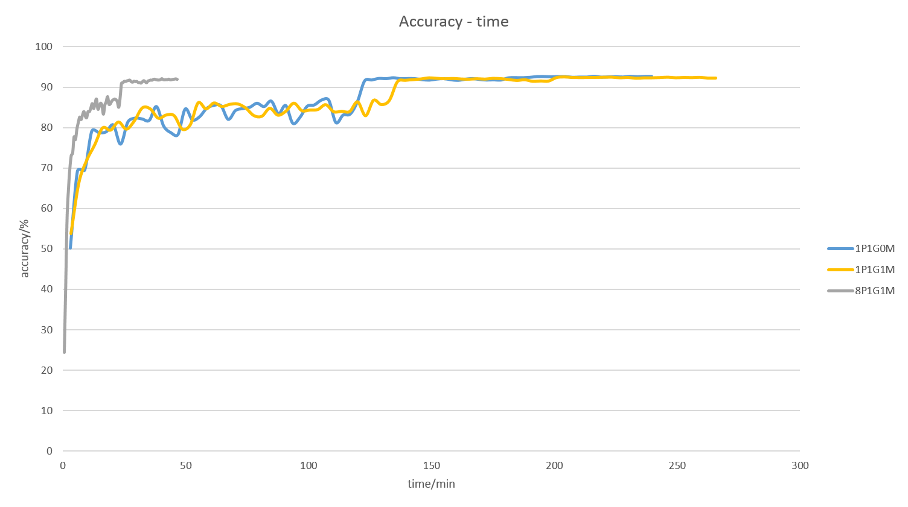

# Experiments

## Codebase
[Deep_Residual_Learning_CIFAR-10](../examples/theano/lasagne/Deep_Residual_Learning_CIFAR-10.py)

## Task Description
Perform CIFAR-10 classification with residual networks implementation based on Lasagne.

## Hardware
|||
| -------- |:--------:|
|Hosts|1|
|GPU|GeForce GTX TITAN X * 4|
|CPU|Intel(R) Core(TM) i7-5960X CPU @ 3.00GHz  * 1|
|Memory| 128GB |


## Theano settings
Configuration of `~/.theanorc`
```
[global]
device = gpu
floatX = float32

[cuda]
root = /usr/local/cuda-7.5/

[lib]
cnmem = 1
```

## About the Model
|||
| :---- | -----: |
|Total epoch|82|
|Batch size|128|
|Depth|32|
|Learning rate change schedule|Initialized as 0.1, Changed to 0.01 from epoch 41, to 0.001 from epoch 61|
|number of parameters in model|    464,154|


Clarification
- An epoch represents all the processes divide all the data equally and go through them once together.
- A barrier is used at the end of each epoch.
- This experiment doesn't use warm start in ASGD.
- The time to load the data is not considered in the time of the experiment.


# The results
The results of 4 experiments with different configurations are shown as following.

|Short Name | With multiverso | Number of Process(es) | Number of GPU(s) | Sync every X minibatches |  Best model validation accuracy | Time per epoch / s |
| :---- | :-----: | :-----: | :-----: | :-----: | :-----: | :-----: |
| 0M-1G | 0 | 1 | 1 | --| 92.61 % | 100.02|
|1M-1G-1S | 1 | 1 | 1 | 1 | 92.61 % | 109.78|
|1M-4G-1S | 1 | 4 | 4 | 1 | 92.15 % | 29.38|
|1M-4G-3S | 1 | 4 | 4 | 3 | 89.61 % | 27.46|




